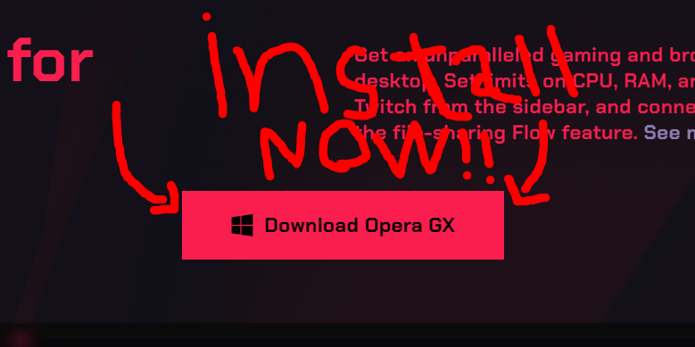
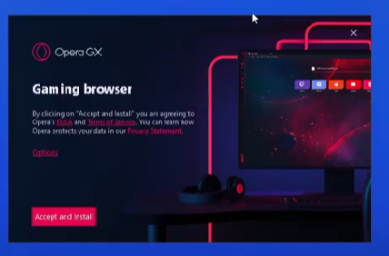
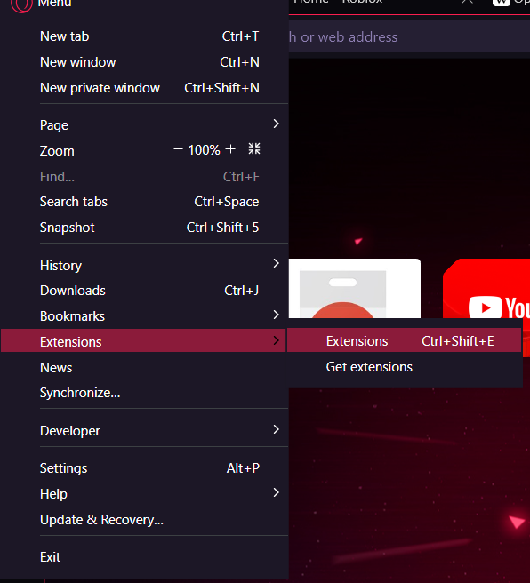

> [!CAUTION]
> This is an old project made specifically for Opera GX when they added the "Mods" feature. 
> It hasn't been updated since 2024, and will it remain this way. 
> Don't bother using this "Mod", and for the love of Oasis, don't bother using Opera (and its products).  
> And one last thing: This README is insanely full of bullshit, and will completely fuck up your brain cells. If you are going to read this, **do so at your own discretion**.

 
 
(ONLY FOR PC!1!1!111!!11)
 
 
Epic reviews!1!!11
 
"Try this mod! It's very epic." - sayu (from no straight roads), 5 stars
 
"very epic gamer" - epsilon, 10 stars
 
"Why the fuck don't you use BetterDiscord for themes?" - No Text To Speech, 1 star
 
"Do not download this mod. (WORST MISTAKE IN MY LIFE)" - alexa, 0 stars

# What is this Opera GX mod?

a mod for mermaid fans! (PLEASE DON'T CANCEL ME ON TWITTER!!!!!)

## How to install it? (The new way)

The mod is now on GX.store! You can download it here
 
https://store.gx.me/mods/rpd2et/opera-gx-mermaid-edition/

## How to install it? (The OLD way)

Step 1: download the Opera GX installer

step 2: install Opera GX, the first browser for epic gamers
 
 
it should look like this

WINDOWS REPORT PLEASE DON'T SUE ME!!!!

step 3: set it up

step 4: click on the Opera GX logo, then go to extensions or press CTRL+Shift+E

step 5: turn on "Developer Mode"

good. you're learning epicly!

step 6: click on "Load Unpacked" (NO IDEA)

step 7: select the "Opera_GX_Mermaid_Edition" folder

and boom! you've installed the mod, pretty cool huh?

to update you must reinstall the folder
